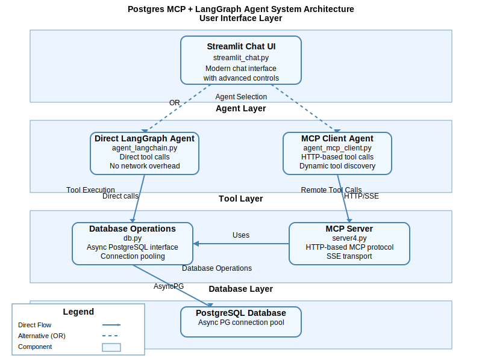

# Postgres MCP + LangGraph Agent System

A comprehensive PostgreSQL database assistant system featuring dual agent architectures: direct LangGraph tools and MCP (Model Context Protocol) server integration. Includes a polished Streamlit chat interface with advanced features like processing time tracking, tool output management, and conversation export.

## 🏗️ Architecture Overview

The system consists of multiple interconnected components working together to provide intelligent database interaction:

### Core Components
- **Database Layer** (`db.py`) - Async PostgreSQL connection management and operations
- **MCP Server** (`server4.py`) - HTTP-based MCP server exposing database tools
- **Agent Layer** - Two agent implementations for different interaction patterns
- **User Interface** (`streamlit_chat.py`) - Modern chat interface with advanced features

### Data Flow
1. **User Input** → Streamlit UI collects messages and configuration
2. **Agent Selection** → Routes to either Direct LangGraph agent or MCP client agent
3. **Tool Execution** → Direct agent calls tools in-process; MCP agent uses HTTP transport
4. **Database Operations** → Tools delegate to asyncpg connection pool in `db.py`
5. **Response Processing** → Results serialized and returned through message chain
6. **UI Display** → Formatted messages with timestamps, processing times, and tool outputs

## 📁 File Structure & Components

### Core Python Scripts

#### `db.py` - Database Operations Layer
**Purpose**: Asynchronous PostgreSQL database interface with connection pooling and metadata operations.

**Key Functions**:
- `get_pool()` / `close_pool()` - Connection pool lifecycle management
- `list_tables(schema)` - Enumerate tables with metadata (name, schema, row counts)
- `describe_table(table_name, schema)` - Column information, data types, constraints, and statistics
- `get_table_sample(table_name, limit, schema)` - Retrieve sample rows with configurable limits
- `execute_sql(query)` - Execute arbitrary SQL queries with result formatting

**Features**:
- AsyncPG connection pooling with configurable min/max sizes
- Schema-qualified table name support
- Comprehensive column metadata extraction
- Row count estimation for large tables
- JSON-formatted result serialization
- Comprehensive error handling and logging

#### `server4.py` - MCP Server Implementation
**Purpose**: FastMCP-based HTTP server exposing PostgreSQL tools via Model Context Protocol.

**Exposed Tools**:
- `list_tables(schema)` - List available tables with metadata
- `describe_table(table_name, schema)` - Detailed table structure information
- `get_table_sample(table_name, limit, schema)` - Sample table data
- `execute_sql(query)` - Execute SQL queries

**Features**:
- SSE (Server-Sent Events) transport for streaming responses
- Session-based communication with automatic cleanup
- Health check endpoint (`/health`)
- Comprehensive tool documentation with parameter descriptions
- Async request handling with proper error responses

#### `agent_langchain.py` - Direct LangGraph Agent
**Purpose**: LangGraph ReAct agent with direct tool integration (no network overhead).

**Architecture**:
- LangChain tool definitions with Pydantic validation
- System prompt with PostgreSQL-specific instructions
- Message history management for conversation context
- Tool result processing and error handling

**Features**:
- Direct function calls to database tools (no HTTP overhead)
- Comprehensive system prompt with usage guidelines
- Conversation history preservation
- Structured error handling and logging

#### `agent_mcp_client.py` - MCP Client Agent
**Purpose**: LangGraph agent that discovers and uses tools from MCP servers over HTTP.

**Architecture**:
- Dynamic tool discovery from MCP server
- Automatic tool wrapping for LangChain compatibility
- SSE client for real-time communication
- Schema-aware tool parameter mapping

**Features**:
- Runtime tool discovery and caching
- Structured vs single-input tool handling
- Comprehensive error handling and logging
- Tool result processing and serialization

#### `streamlit_chat.py` - Chat User Interface
**Purpose**: Modern, feature-rich chat interface for database interaction.

**Key Features**:
- **Dual Agent Support**: Toggle between Direct and MCP agent modes
- **Advanced UI Controls**:
  - New Chat / Clear Chat buttons
  - Tool output visibility toggle
  - Processing time display with color coding
  - Conversation export to JSON
- **Message Display**:
  - Reverse chronological order (latest first)
  - Color-coded message bubbles (user=blue, assistant=purple, tools=orange)
  - Timestamps and processing time indicators
  - Copy buttons for message content
  - Expandable tool output sections
- **Input Interface**:
  - Large text area for multi-line queries
  - Form-based submission with validation
  - Example query suggestions for new conversations

#### `smoke_mcp.py` - MCP Server Testing
**Purpose**: Comprehensive smoke test suite for MCP server functionality.

**Test Coverage**:
- Server initialization and capability detection
- Tool discovery and metadata validation
- Basic tool execution (list_tables)
- Advanced operations (describe_table, get_table_sample)
- Error handling and response parsing

**Features**:
- Automated test execution with clear output
- JSON result parsing and validation
- Graceful handling of missing data
- Comprehensive logging for debugging

#### `__init__.py` - Package Initialization
**Purpose**: Python package marker file (currently empty).

## 🔧 Configuration

### Environment Variables

See `.env.example` for a complete configuration template. Key variables include:

#### Database Configuration
```bash
PGHOST=localhost                    # PostgreSQL host
PGPORT=5432                        # PostgreSQL port
PGUSER=your_username               # Database username
PGPASSWORD=your_password           # Database password
PGDATABASE=your_database           # Database name
PGSSL=false                        # SSL mode (false/require)
PGPOOL_MIN_SIZE=1                  # Minimum connection pool size
PGPOOL_MAX_SIZE=10                 # Maximum connection pool size
PGPOOL_COMMAND_TIMEOUT=30          # Query timeout in seconds
```

#### Server Configuration
```bash
POSTGRES_MCP_HOST=0.0.0.0         # MCP server bind address
POSTGRES_MCP_PORT=8010            # MCP server port
POSTGRES_MCP_PATH=/mcp             # MCP endpoint path
POSTGRES_MCP_URL=http://localhost:8010/mcp  # Full MCP server URL
```

#### AI/ML Configuration
```bash
OPENAI_API_KEY=your_api_key        # OpenAI API key
OPENAI_MODEL=gpt-4o-mini          # Default model for chat
```

## 🚀 Quick Start

### 1. Install Dependencies
```bash
cd postgres_gpt
pip install -r requirements.txt
```

### 2. Configure Environment
```bash
# Copy and edit environment variables
cp .env.example .env
# Edit .env with your database credentials and API keys
```

### 3. Start MCP Server
```bash
python -m postgres_gpt.server4
# Server runs on http://localhost:8010
# Health check: curl http://localhost:8010/health
```

### 4. Test MCP Server (Optional)
```bash
python -m postgres_gpt.smoke_mcp
# Runs comprehensive smoke tests
```

### 5. Launch Chat Interface
```bash
streamlit run postgres_gpt/streamlit_chat.py
# Opens browser at http://localhost:8501
```

## 🔄 Usage Examples

### Basic Table Exploration
```
User: List all tables in the database
Assistant: Here are the available tables:
- public.actor
- public.address
- public.category
...

User: Describe the actor table
Assistant: The public.actor table has the following structure:
- actor_id (integer, primary key, auto-increment)
- first_name (varchar(45), not null)
- last_name (varchar(45), not null)
- last_update (timestamp, not null)
Total rows: 200
```

### Complex Queries
```
User: Show me the top 3 actors by movie count
Assistant: I'll need to join the actor and film_actor tables...

[Tool execution with SQL query]
SELECT a.first_name, a.last_name, COUNT(fa.film_id) as movie_count
FROM actor a
JOIN film_actor fa ON a.actor_id = fa.actor_id
GROUP BY a.actor_id, a.first_name, a.last_name
ORDER BY movie_count DESC
LIMIT 3;

Results:
1. Gina Degeneres - 42 movies
2. Walter Torn - 41 movies
3. Mary Keitel - 40 movies
```

## 📊 Architecture Diagram



The diagram shows the four-layer architecture:
- **User Interface Layer**: Streamlit-based chat interface with advanced controls
- **Agent Layer**: Dual agent implementations (Direct and MCP client)
- **Tool Layer**: Database operation tools with different execution paths
- **Database Layer**: PostgreSQL with async connection pooling

Data flows from user input through agent selection, tool execution, and database operations, with responses flowing back up through the layers.

## 📡 Streamable HTTP vs SSE

Streamable HTTP is a response pattern that keeps the plain HTTP request/response model but streams chunks as soon as they are ready. It typically uses `Transfer-Encoding: chunked` (or HTTP/2 data frames) to deliver partial payloads plus a final summary without switching protocols.

### Why it often beats SSE
- Works over standard HTTP stacks (CDNs, proxies, load balancers) without requiring `text/event-stream` upgrades.
- Carries binary or mixed payloads (JSON, embeddings, files) without SSE’s text-only framing.
- Better fits multi-part responses: early tokens first, structured metadata or cost stats at the end.
- Simple client handling: any HTTP client that supports streaming bodies can consume it; no event parsing needed.

### Where SSE can still win
- Built-in retry semantics with `Last-Event-ID` if you need automatic reconnection.
- Very lightweight for tiny, text-only event feeds.
- Broad browser support with `EventSource` when you don’t control clients.

### Practical guidance
- Use streamable HTTP when you need end-to-end compatibility through proxies/CDNs, binary frames, or structured multi-part outputs (e.g., deltas + final JSON summary) while staying on vanilla HTTP.
- Stick with SSE for simple, text-only live updates where `EventSource` is sufficient and reconnect logic matters more than payload flexibility.

Reference: comparison and benchmarks in [Medium: Streamable HTTP vs SSE](https://medium.com/@higress_ai/comparison-of-data-before-and-after-using-streamable-http-b094db8b414e).

## 🔍 Monitoring & Debugging

### Logging
- All components write to `agent_activity.log`
- Comprehensive request/response logging
- Tool execution timing and errors
- Database connection pool status

### Health Checks
- MCP Server: `GET /health` returns database connectivity status
- Streamlit UI: Visual feedback for agent responses
- Tool validation: Automatic error handling and retries

### Performance Monitoring
- Query execution times tracked in UI
- Connection pool utilization logging
- Agent reasoning step timing

## 🛡️ Security Considerations

### Database Security
- Use SSL connections for production (`PGSSL=require`)
- Implement proper authentication and authorization
- Avoid exposing `execute_sql` tool in untrusted environments
- Use parameterized queries when possible

### API Security
- OpenAI API key protection via environment variables
- Input validation on all user-provided SQL
- Rate limiting considerations for production deployment

### Network Security
- Bind MCP server to appropriate interfaces
- Use HTTPS in production environments
- Implement proper CORS policies if needed

## 🚀 Deployment Options

### Local Development
- Single machine with local PostgreSQL
- Direct tool access for maximum performance
- Full debugging and logging capabilities

### Containerized Deployment
```dockerfile
FROM python:3.11-slim
WORKDIR /app
COPY requirements.txt .
RUN pip install -r requirements.txt
COPY . .
EXPOSE 8010 8501
CMD ["python", "-m", "postgres_gpt.server4"]
```

### Cloud Deployment
- Separate MCP server and UI instances
- Load balancer for high availability
- Managed PostgreSQL services (RDS, Cloud SQL, etc.)
- API Gateway for external access control

## 🤝 Contributing

### Development Setup
1. Fork the repository
2. Create a feature branch
3. Make changes with comprehensive tests
4. Update documentation
5. Submit pull request

### Testing
- Run smoke tests: `python -m postgres_gpt.smoke_mcp`
- Test both agent modes in Streamlit UI
- Verify database operations with various schemas
- Check error handling and edge cases

### Code Standards
- Type hints for all function parameters
- Comprehensive docstrings
- Async/await for database operations
- Structured logging with appropriate levels
- Error handling with meaningful messages

## 📝 Changelog

### Latest Updates (v2.0)
- ✨ **Enhanced Chat UI**: Complete redesign with modern styling, processing time tracking, and advanced controls
- 🛠️ **Improved Agent Responses**: Removed system prompt repetition for cleaner output
- 📊 **Better Monitoring**: Comprehensive logging and performance tracking
- 🔧 **Architecture Refinements**: Cleaner separation between direct and MCP agent modes
- 📚 **Documentation**: Comprehensive README with architecture diagrams and usage examples

### Previous Versions
- v1.0: Initial implementation with basic MCP server and Streamlit UI
- v0.5: Direct LangGraph agent integration
- v0.1: Core database operations and tool definitions

---

**Built with**: Python 3.10+, FastMCP, LangGraph, Streamlit, asyncpg
**License**: MIT
**Maintainers**: CloserStill Team
